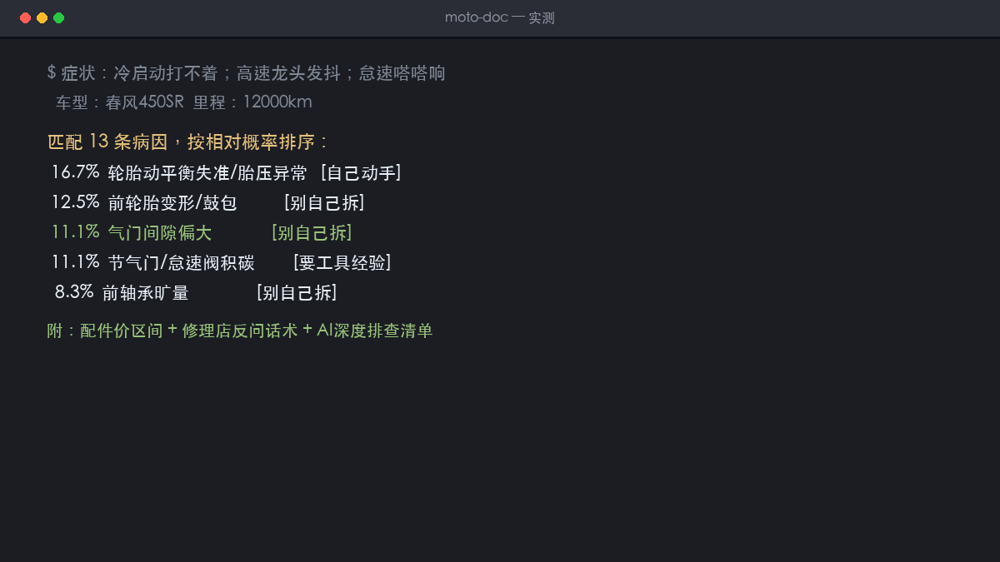

# 大排诊脉 MotoDoc

大排量摩托故障问诊：大白话描述症状 → 病因概率排序 + DIY 可行性分级 + 配件价区间 + 问 AI 深度排查清单。



## 解决什么问题

- **修车靠玄学**：网上内容一半是带货短视频，一半是手册黑话；自己的症状对不上号，只能全程被报价牵着走
- **没人管决策层**：哪个能自己动手、哪个千万别拆、配件什么价、怎么问才不被过度维修——没有一个工具说人话

本工具内置 17 组症状规则库（机械通用知识 + 车型社区高频问题），大白话输入症状，输出病因概率排序 + DIY 三级标签 + 配件参考价区间 + 「问 AI 深度排查」问题清单（含防过度维修的反问话术）。

## 特性

- 零依赖：纯 Python 标准库，`python3 app.py` 一条命令跑起来
- 暗色单页前端，手机浏览器直接用
- 每次生成都落盘 JSON + 可下载 Markdown 交付物

## 快速开始

```bash
python3 app.py    # http://127.0.0.1:8691
```

## 数据锚定

所有红线/认证/价格区间数据锚定 2025-2026 公开信源（官方通报、部委公告、主流媒体），页脚均有标注。信息以官方最新公告为准，本工具不构成行程/合规/维修的唯一依据。

## 免责声明

路书管规划，替代不了出发前当天的官方路况通报；合规测算为区间估算，申报以认证机构与目标国官方要求为准；病因为概率判断非确诊，安全件（刹车/轮胎/减震/ABS）以实车检修为准。

## License

MIT
